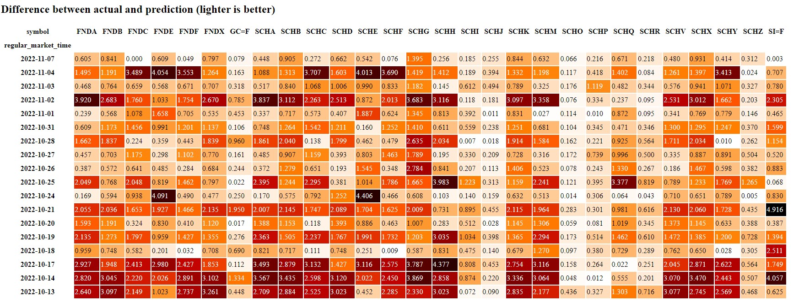

# Hackernews Stock Predictor

The general idea of this is as follows:

Hackernews comments -> AI -> stock predictions

Don't expect it to give any useful predictions :).

## Details

It uses [Steampipe](https://steampipe.io/) to download [Hackernews](https://hub.steampipe.io/plugins/turbot/hackernews)
and [Yahoo Finance](https://hub.steampipe.io/plugins/turbot/finance) data.

Only Hackernews comments are used. These comments are split up into 2+ word n-grams.

Linear regression is used to correlate the frequency of these n-grams over 1 day to
percentage stock price changes on that day. A prediction is then made for the following day.

See [conda.export](conda.export) for packages needed.

## Examples

## Files

[daily.py](daily.py) is the main script that is run daily.
